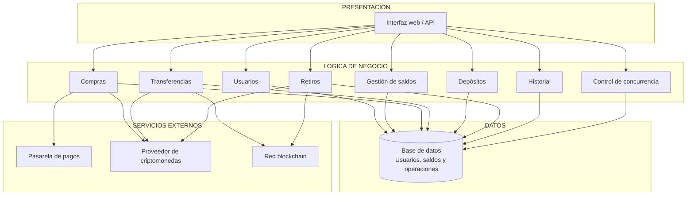
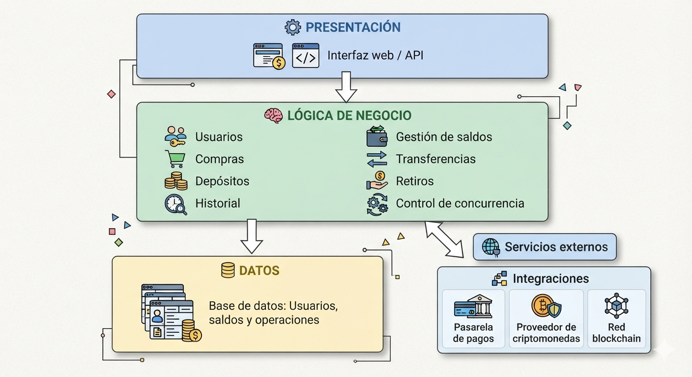

# 07. Arquitectura inicial

## Objetivo

Organizar los módulos identificados dentro de una primera propuesta de arquitectura, utilizando una arquitectura de tres capas.

---

## 7.1. Arquitectura de tres capas

---

## 7.2. Descripción de las capas

| Capa | Pregunta que responde | Función |
|------|-----------------------|---------|
| Presentación | ¿Cómo interactúa el usuario? | Proporciona la interfaz web y la comunicación mediante API REST. |
| Lógica de negocio | ¿Qué hace el sistema? | Gestiona usuarios, saldos, compras, transferencias y control de concurrencia. |
| Datos | ¿Dónde se almacena la información? | Almacena los usuarios, saldos, operaciones e historial de transacciones. |

---

## 7.3. Diagrama de arquitectura por capas

