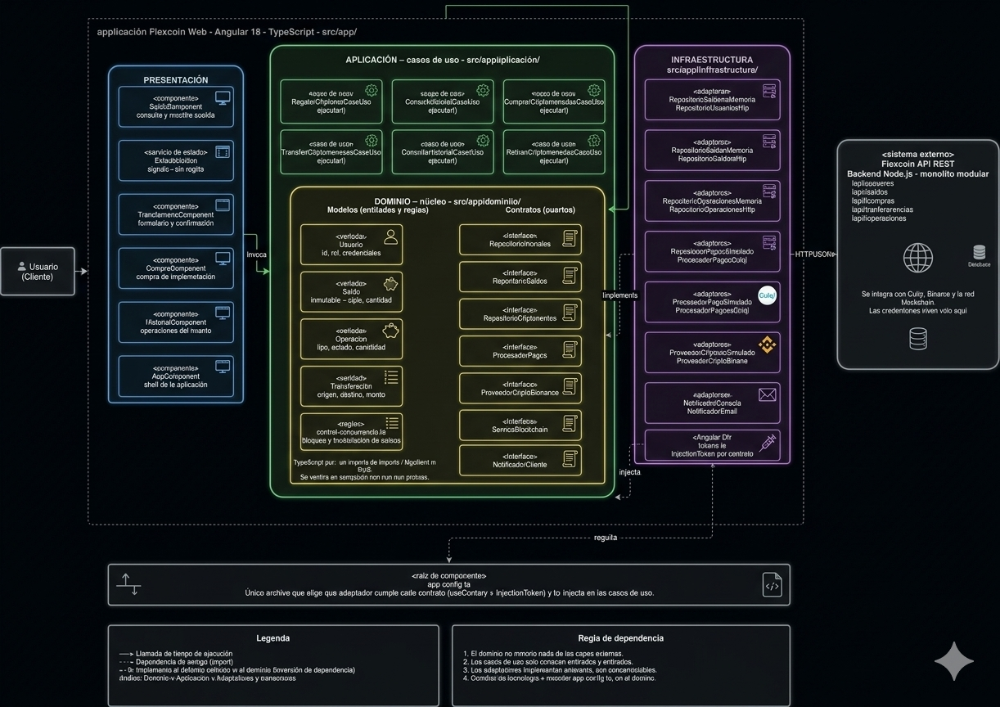
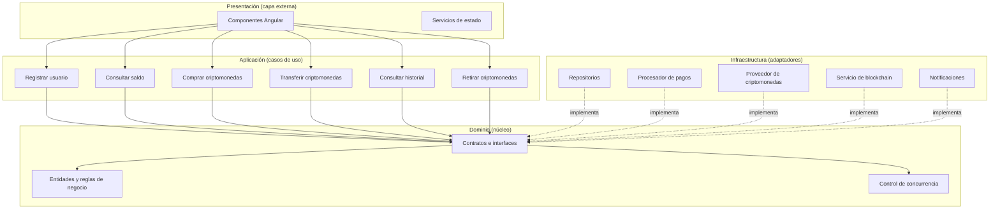

# Estilo Arquitectónico

## Objetivo

Definir el estilo arquitectónico del sistema Flexcoin y representar su estructura global mediante un diagrama que muestre los principales componentes y sus relaciones.

---

## Estilo seleccionado

**Monolito modular con arquitectura en capas.**

El sistema se despliega como una aplicación única, pero internamente se organiza en módulos independientes y capas bien definidas. Esta combinación responde a los drivers arquitectónicos identificados en el análisis.

---

## Justificación

| Driver | Cómo lo responde el estilo |
|--------|----------------------------|
| DA01 Consistencia | El control de concurrencia se centraliza en un módulo específico dentro del monolito, evitando conflictos entre operaciones. |
| DA02 Rendimiento | La separación por capas permite incorporar caché para consultas frecuentes de saldos. |
| DA03 Seguridad | La autenticación y autorización se gestionan en la capa de presentación y en los servicios de usuarios. |
| DA04 Servicios externos | Los adaptadores para la pasarela de pagos y el proveedor de criptomonedas se aíslan en la capa de datos e infraestructura. |
| DA06 Mantenibilidad | La modularidad y las capas permiten modificar una parte del sistema sin afectar otras. |

---

## Capas del sistema

| Capa | Responsabilidad |
|------|-----------------|
| Presentación | Recibe las peticiones HTTP, valida los datos de entrada y devuelve respuestas JSON. |
| Lógica de negocio | Aplica las reglas del sistema, coordina los módulos y controla la concurrencia. |
| Datos | Gestiona la persistencia y las consultas a la base de datos. |

---

## Módulos del sistema

| Módulo | Responsabilidad |
|--------|-----------------|
| Usuarios | Registro, autenticación y gestión de cuentas. |
| Saldos | Consulta y actualización de los saldos de criptomonedas. |
| Compras | Órdenes de compra y confirmación con la pasarela de pagos. |
| Transferencias | Movimientos de criptomonedas entre usuarios. |
| Operaciones | Historial, retiros y depósitos. |
| Control de concurrencia | Bloqueo y serialización de las operaciones que modifican saldos. |

---

## Sistemas externos

| Sistema | Propósito |
|---------|-----------|
| Pasarela de pagos | Procesar pagos para la compra de criptomonedas. |
| Proveedor de criptomonedas | Adquirir, consultar y transferir criptomonedas reales. |
| Red blockchain | Validar y registrar transacciones on-chain. |
| Servicio de notificaciones | Informar al usuario sobre el estado de sus operaciones. |

---

## Relación con el enfoque arquitectónico

La arquitectura en capas se complementa con el enfoque **Clean Architecture**, que organiza internamente cada capa en Dominio, Aplicación, Infraestructura y Presentación, con dependencias siempre apuntando hacia el dominio.

Esto significa que:

- La capa de **Presentación** del estilo corresponde a la capa de **Presentación + Infraestructura** del enfoque.
- La capa de **Lógica de negocio** del estilo corresponde a las capas de **Aplicación + Dominio** del enfoque.
- La capa de **Datos** del estilo corresponde a la capa de **Infraestructura** del enfoque.

El detalle completo del enfoque se documenta en `arquitectura/enfoque/enfoque-arquitectonico.md`.

---

## Diagrama de estructura global

---

## Flujo de dependencias

Las flechas continuas representan invocación en tiempo de ejecución. Las flechas discontinuas representan la implementación de contratos definidos en el dominio.

---

## Regla de dependencias

1. El dominio no importa nada de las capas externas.
2. Los casos de uso solo conocen entidades y contratos.
3. Los adaptadores implementan contratos y son intercambiables.
4. Cambiar de tecnología implica modificar la infraestructura, no el dominio.