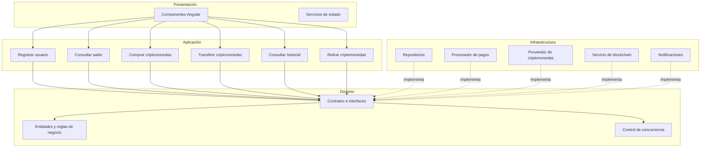

# Enfoque Arquitectónico

## Objetivo

Definir el enfoque arquitectónico que guía la organización interna del código y el control de dependencias del sistema Flexcoin.

---

## Enfoque seleccionado

**Clean Architecture (Arquitectura Limpia).**

---

## Descripción aplicada a Flexcoin

| Elemento | Descripción aplicada a Flexcoin |
|----------|----------------------------------|
| Patrón / enfoque arquitectónico | Clean Architecture (Arquitectura Limpia). |
| Objetivo | Separar las reglas de negocio de los detalles tecnológicos y controlar las dependencias hacia el dominio. |
| ¿Qué problema resuelve? | Evita el acoplamiento entre la interfaz web, las reglas del negocio como el control de saldos y transferencias, y las tecnologías externas como base de datos, pasarela de pagos y proveedor de criptomonedas. |
| Capas definidas | Dominio, Aplicación, Infraestructura y Presentación. |
| Beneficios | Facilita el mantenimiento y las pruebas unitarias. Permite cambiar el proveedor de criptomonedas o la pasarela de pagos sin afectar las reglas del negocio. Mejora la organización y separación de responsabilidades del código. |

---

## Regla de dependencias

Las dependencias siempre apuntan hacia el dominio.

- La capa de **Presentación** depende de **Aplicación**.
- La capa de **Aplicación** depende de **Dominio**.
- La capa de **Infraestructura** implementa los contratos definidos en **Dominio**, pero no al revés.
- El **Dominio** no depende de ninguna otra capa.

Esto garantiza que las reglas del negocio, especialmente el control de concurrencia y la consistencia de saldos, permanezcan aisladas de los detalles tecnológicos.

---

## Capas y responsabilidades

| Capa | Responsabilidad en Flexcoin |
|------|------------------------------|
| Presentación | Interfaz Angular y API REST. Recibe las peticiones del usuario y las responde. |
| Aplicación | Casos de uso como comprar criptomonedas, transferir saldos, consultar historial. Coordina las operaciones. |
| Dominio | Entidades como Usuario, Saldo, Operación. Reglas de negocio como validar fondos, controlar concurrencia y evitar sobregiros. |
| Infraestructura | Implementaciones concretas de repositorios, adaptadores de pasarela de pagos, proveedor de criptomonedas y notificaciones. |

---

## Módulos del sistema dentro del enfoque

| Módulo | Capa principal | Responsabilidad |
|--------|----------------|-----------------|
| Usuarios | Dominio y Aplicación | Registro, autenticación, roles. |
| Saldos | Dominio | Consulta y actualización de saldos. |
| Compras | Aplicación | Orquestar compra de criptomonedas. |
| Transferencias | Aplicación | Orquestar transferencias entre usuarios. |
| Operaciones | Aplicación | Historial, retiros y depósitos. |
| Control de concurrencia | Dominio | Reglas que evitan inconsistencias en los saldos. |

---

## Diagrama del enfoque arquitectónico

---

## Diagrama de dependencias en Mermaid

Las flechas continuas representan invocación en tiempo de ejecución. Las flechas discontinuas representan la implementación de contratos definidos en el dominio.

---

## Aplicación del enfoque en Flexcoin

### Dominio aislado

El dominio contiene las entidades y las reglas de negocio críticas, como el control de concurrencia para evitar inconsistencias en los saldos. No depende de Angular, Express, la base de datos, ni los SDK de Culqi, Binance o blockchain.

### Casos de uso en la capa de aplicación

Los casos de uso orquestan las operaciones del sistema. Por ejemplo, `ComprarCriptomonedasCasoUso` coordina el repositorio de saldos, el procesador de pagos, el proveedor de criptomonedas y el notificador. Pero solo conoce las interfaces, no las implementaciones concretas.

### Adaptadores intercambiables en infraestructura

Los adaptadores implementan los contratos definidos en el dominio. Por ejemplo, `ProcesadorPagosCulqi` y `ProcesadorPagosSimulado` implementan `ProcesadorPagos`. Cambiar de proveedor implica agregar un nuevo adaptador, no tocar la lógica del negocio.

### Raíz de composición

El archivo `app.config.ts` es el único lugar donde se decide qué adaptador cumple cada contrato. Usa `useFactory` e `InjectionToken` para inyectar las implementaciones en los casos de uso.

---

## Beneficios del enfoque en Flexcoin

- **Pruebas sin infraestructura.** El dominio puede probarse sin navegador, sin base de datos y sin servicios externos.
- **Cambio de proveedor sin dolor.** Cambiar de Culqi a Niubiz implica escribir un adaptador nuevo, no modificar la lógica de compras.
- **Consistencia controlada.** El control de concurrencia vive en el dominio y no puede ser evadido por ningún adaptador.
- **Mantenibilidad real.** Cada capa tiene una responsabilidad clara, lo que reduce el acoplamiento y facilita la evolución del sistema.