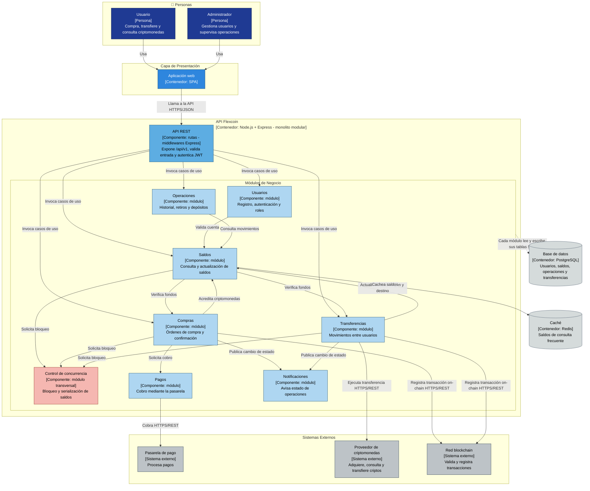

```mermaid
flowchart TB
    %% ============ ACTORES ============
    subgraph Personas ["👤 Personas"]
        Usuario["Usuario<br/>[Persona]<br/>Compra, transfiere y consulta criptomonedas"]
        Admin["Administrador<br/>[Persona]<br/>Gestiona usuarios y supervisa operaciones"]
    end

    %% ============ FRONT-END ============
    subgraph Front ["Capa de Presentación"]
        WebApp["Aplicación web<br/>[Contenedor: SPA]"]
    end

    %% ============ BACKEND (MONOLITO) ============
    subgraph Backend ["API Flexcoin<br/>[Contenedor: Node.js + Express - monolito modular]"]

        API["API REST<br/>[Componente: rutas - middlewares Express]<br/>Expone /api/v1, valida entrada y autentica JWT"]

        subgraph Modulos ["Módulos de Negocio"]
            ModUsr["Usuarios<br/>[Componente: módulo]<br/>Registro, autenticación y roles"]
            ModSal["Saldos<br/>[Componente: módulo]<br/>Consulta y actualización de saldos"]
            ModCom["Compras<br/>[Componente: módulo]<br/>Órdenes de compra y confirmación"]
            ModTrans["Transferencias<br/>[Componente: módulo]<br/>Movimientos entre usuarios"]
            ModOp["Operaciones<br/>[Componente: módulo]<br/>Historial, retiros y depósitos"]
            ModConc["Control de concurrencia<br/>[Componente: módulo transversal]<br/>Bloqueo y serialización de saldos"]
            ModPag["Pagos<br/>[Componente: módulo]<br/>Cobro mediante la pasarela"]
            ModNot["Notificaciones<br/>[Componente: módulo]<br/>Avisa estado de operaciones"]
        end
    end

    %% ============ ALMACENAMIENTO ============
    Cache[("Caché<br/>[Contenedor: Redis]<br/>Saldos de consulta frecuente")]
    DB[("Base de datos<br/>[Contenedor: PostgreSQL]<br/>Usuarios, saldos, operaciones y transferencias")]

    %% ============ SISTEMAS EXTERNOS ============
    subgraph Externos ["Sistemas Externos"]
        Pasarela["Pasarela de pago<br/>[Sistema externo]<br/>Procesa pagos"]
        Proveedor["Proveedor de criptomonedas<br/>[Sistema externo]<br/>Adquiere, consulta y transfiere criptos"]
        Blockchain["Red blockchain<br/>[Sistema externo]<br/>Valida y registra transacciones"]
    end

    %% ============ CONEXIONES ============
    Usuario -->|Usa| WebApp
    Admin -->|Usa| WebApp

    WebApp -->|Llama a la API HTTPS/JSON| API

    API -->|Invoca casos de uso| ModUsr
    API -->|Invoca casos de uso| ModSal
    API -->|Invoca casos de uso| ModCom
    API -->|Invoca casos de uso| ModTrans
    API -->|Invoca casos de uso| ModOp

    ModUsr -->|Valida cuenta| ModSal
    ModSal -->|Verifica fondos| ModCom
    ModSal -->|Verifica fondos| ModTrans

    ModCom -->|Acredita criptomonedas| ModSal
    ModCom -->|Solicita cobro| ModPag
    ModCom -->|Registra transacción on-chain HTTPS/REST| Blockchain

    ModTrans -->|Actualiza saldos origen y destino| ModSal
    ModTrans -->|Ejecuta transferencia HTTPS/REST| Proveedor
    ModTrans -->|Registra transacción on-chain HTTPS/REST| Blockchain

    ModOp -->|Consulta movimientos| ModSal

    ModSal -->|Solicita bloqueo| ModConc
    ModCom -->|Solicita bloqueo| ModConc
    ModTrans -->|Solicita bloqueo| ModConc

    ModPag -->|Cobra HTTPS/REST| Pasarela

    ModCom -->|Publica cambio de estado| ModNot
    ModTrans -->|Publica cambio de estado| ModNot

    ModSal -->|Cachea saldos| Cache

    Modulos -.->|Cada módulo lee y escribe sus tablas SQL| DB

    %% ============ ESTILOS ============
    style Usuario fill:#1f3a93,stroke:#0d1e4c,color:#ffffff
    style Admin fill:#1f3a93,stroke:#0d1e4c,color:#ffffff
    style WebApp fill:#2e86de,stroke:#1b4f72,color:#ffffff
    style API fill:#5dade2,stroke:#1b4f72,color:#000000
    style ModUsr fill:#aed6f1,stroke:#1b4f72,color:#000000
    style ModSal fill:#aed6f1,stroke:#1b4f72,color:#000000
    style ModCom fill:#aed6f1,stroke:#1b4f72,color:#000000
    style ModTrans fill:#aed6f1,stroke:#1b4f72,color:#000000
    style ModOp fill:#aed6f1,stroke:#1b4f72,color:#000000
    style ModConc fill:#f5b7b1,stroke:#922b21,color:#000000
    style ModPag fill:#aed6f1,stroke:#1b4f72,color:#000000
    style ModNot fill:#aed6f1,stroke:#1b4f72,color:#000000
    style Cache fill:#d5dbdb,stroke:#566573,color:#000000
    style DB fill:#d5dbdb,stroke:#566573,color:#000000
    style Pasarela fill:#bdc3c7,stroke:#2c3e50,color:#000000
    style Proveedor fill:#bdc3c7,stroke:#2c3e50,color:#000000
    style Blockchain fill:#bdc3c7,stroke:#2c3e50,color:#000000
```