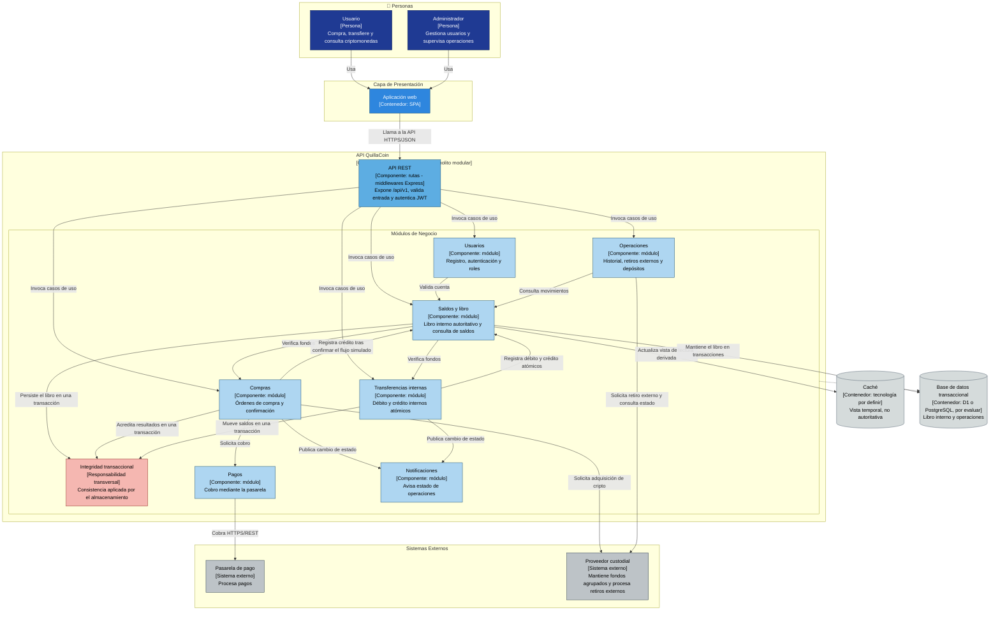

```mermaid
flowchart TB
    %% ============ ACTORES ============
    subgraph Personas ["👤 Personas"]
        Usuario["Usuario<br/>[Persona]<br/>Compra, transfiere y consulta criptomonedas"]
        Admin["Administrador<br/>[Persona]<br/>Gestiona usuarios y supervisa operaciones"]
    end

    %% ============ FRONT-END ============
    subgraph Front ["Capa de Presentación"]
        WebApp["Aplicación web<br/>[Contenedor: SPA]"]
    end

    %% ============ BACKEND (MONOLITO) ============
    subgraph Backend ["API QuillaCoin<br/>[Contenedor: Node.js + Express - monolito modular]"]

        API["API REST<br/>[Componente: rutas - middlewares Express]<br/>Expone /api/v1, valida entrada y autentica JWT"]

        subgraph Modulos ["Módulos de Negocio"]
            ModUsr["Usuarios<br/>[Componente: módulo]<br/>Registro, autenticación y roles"]
            ModSal["Saldos y libro<br/>[Componente: módulo]<br/>Libro interno autoritativo y consulta de saldos"]
            ModCom["Compras<br/>[Componente: módulo]<br/>Órdenes de compra y confirmación"]
            ModTrans["Transferencias internas<br/>[Componente: módulo]<br/>Débito y crédito internos atómicos"]
            ModOp["Operaciones<br/>[Componente: módulo]<br/>Historial, retiros externos y depósitos"]
            ModConc["Integridad transaccional<br/>[Responsabilidad transversal]<br/>Consistencia aplicada por el almacenamiento"]
            ModPag["Pagos<br/>[Componente: módulo]<br/>Cobro mediante la pasarela"]
            ModNot["Notificaciones<br/>[Componente: módulo]<br/>Avisa estado de operaciones"]
        end
    end

    %% ============ ALMACENAMIENTO ============
    Cache[("Caché<br/>[Contenedor: tecnología por definir]<br/>Vista temporal, no autoritativa")]
    DB[("Base de datos transaccional<br/>[Contenedor: D1 o PostgreSQL, por evaluar]<br/>Libro interno y operaciones")]

    %% ============ SISTEMAS EXTERNOS ============
    subgraph Externos ["Sistemas Externos"]
        Pasarela["Pasarela de pago<br/>[Sistema externo]<br/>Procesa pagos"]
        Proveedor["Proveedor custodial<br/>[Sistema externo]<br/>Mantiene fondos agrupados y procesa retiros externos"]
    end

    %% ============ CONEXIONES ============
    Usuario -->|Usa| WebApp
    Admin -->|Usa| WebApp

    WebApp -->|Llama a la API HTTPS/JSON| API

    API -->|Invoca casos de uso| ModUsr
    API -->|Invoca casos de uso| ModSal
    API -->|Invoca casos de uso| ModCom
    API -->|Invoca casos de uso| ModTrans
    API -->|Invoca casos de uso| ModOp

    ModUsr -->|Valida cuenta| ModSal
    ModSal -->|Verifica fondos| ModCom
    ModSal -->|Verifica fondos| ModTrans

    ModCom -->|Registra crédito tras confirmar el flujo simulado| ModSal
    ModCom -->|Solicita cobro| ModPag
    ModCom -->|Solicita adquisición de cripto| Proveedor

    ModTrans -->|Registra débito y crédito atómicos| ModSal

    ModOp -->|Consulta movimientos| ModSal
    ModOp -->|Solicita retiro externo y consulta estado| Proveedor

    ModSal -->|Persiste el libro en una transacción| ModConc
    ModCom -->|Acredita resultados en una transacción| ModConc
    ModTrans -->|Mueve saldos en una transacción| ModConc

    ModPag -->|Cobra HTTPS/REST| Pasarela

    ModCom -->|Publica cambio de estado| ModNot
    ModTrans -->|Publica cambio de estado| ModNot

    ModSal -->|Actualiza vista de lectura derivada| Cache

    ModSal -->|Mantiene el libro en transacciones| DB
    Modulos -.->|Usan repositorios; Saldos es propietario del libro| DB

    %% ============ ESTILOS ============
    style Usuario fill:#1f3a93,stroke:#0d1e4c,color:#ffffff
    style Admin fill:#1f3a93,stroke:#0d1e4c,color:#ffffff
    style WebApp fill:#2e86de,stroke:#1b4f72,color:#ffffff
    style API fill:#5dade2,stroke:#1b4f72,color:#000000
    style ModUsr fill:#aed6f1,stroke:#1b4f72,color:#000000
    style ModSal fill:#aed6f1,stroke:#1b4f72,color:#000000
    style ModCom fill:#aed6f1,stroke:#1b4f72,color:#000000
    style ModTrans fill:#aed6f1,stroke:#1b4f72,color:#000000
    style ModOp fill:#aed6f1,stroke:#1b4f72,color:#000000
    style ModConc fill:#f5b7b1,stroke:#922b21,color:#000000
    style ModPag fill:#aed6f1,stroke:#1b4f72,color:#000000
    style ModNot fill:#aed6f1,stroke:#1b4f72,color:#000000
    style Cache fill:#d5dbdb,stroke:#566573,color:#000000
    style DB fill:#d5dbdb,stroke:#566573,color:#000000
    style Pasarela fill:#bdc3c7,stroke:#2c3e50,color:#000000
    style Proveedor fill:#bdc3c7,stroke:#2c3e50,color:#000000
```